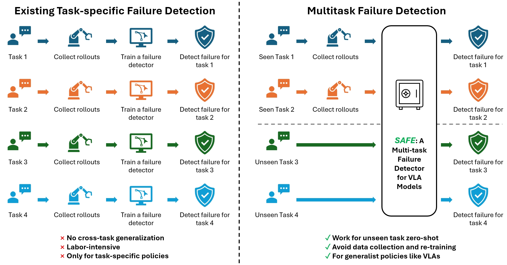

# SAFE: Multitask Failure Detection for Vision-Language-Action Models

**Neural Information Processing Systems (NeurIPS) 2025**

[**Project Page**](https://vla-safe.github.io/) |
[**Paper**](https://arxiv.org/pdf/2506.09937) |
[**ArXiv**](https://arxiv.org/abs/2506.09937)


[Qiao Gu](https://georgegu1997.github.io/),
[Yuanliang Ju](https://scholar.google.com/citations?user=rG90YVAAAAAJ&hl=zh-CN),
[Shengxiang Sun](https://owensun2004.github.io/),
[Igor Gilitschenski](https://www.gilitschenski.org/igor/),
[Haruki Nishimura](https://harukins.github.io/),
[Masha Itkina](https://mashaitkina.weebly.com/),
[Florian Shkurti](https://www.cs.toronto.edu/~florian/)



We introduce the **multitask failure detection** problem for VLA models, and propose **SAFE**, a failure detector that can detect failures for unseen tasks zero-shot and achieve state-of-the-art performance. This repo contains the implementation of SAFE. 

## Generate rollouts from VLA models

Please follow the following repo for adapted code that runs VLA models on simulated environments and generates rollouts for failure detection. Detailed instructions can be found in the README files of these repos. 

* [openvla](https://github.com/vla-safe/openvla) for OpenVLA model on the LIBERO benchmark.
* [openpi](https://github.com/vla-safe/openpi) for pi0 and pi0-FAST models on the LIBERO benchmark. 
* [open-pi-zero](https://github.com/vla-safe/open-pi-zero) for pi0* models on the SimplerEnv benchmark. 
* Collected rollouts by running pi0-FAST model on a Franka robot in our lab can be downloaded from [this link](https://drive.google.com/file/d/13z_cdwnaJota2iHkZbhYgVALujZwtM3b/view?usp=sharing).
* Collected rollouts by running OpenVLA model on a WidowX robot in our lab can be downloaded from [this link](https://drive.google.com/file/d/1EwaccasZjnlM9L6SEYyWqTd7d6-BR9zp/view?usp=sharing).

After generating the rollouts, please duplicate `setup_envs.bash.template` and edit environment variables inside according to the locations of the generated rollouts.

```bash
cp setup_envs.bash.template setup_envs.bash

# TODO: Please edit the setup_envs.bash file to set the environment variables
```


## Train and evaluate SAFE and baseline failure detectors

### Setup

```bash
git clone git@github.com:vla-safe/SAFE.git

# Create a new conda environment (or other virtual environment management tool)
conda create -n vla-safe python=3.10
conda activate vla-safe

# Install pytorch (the newest version should be fine)
pip3 install torch torchvision torchaudio --index-url https://download.pytorch.org/whl/cu128

# Install other required packages
pip install pandas scipy pyyaml tqdm imageio[ffmpeg] hydra-core omegaconf scikit-learn opencv_python einops wandb plotly matplotlib natsort flask ml_dtypes

# Log in your wandb account
wandb login

# Install this codebase as a package
# cd to the root directory of this repo
pip install -e .
```

### Training and evaluation 

Please see the following file for training and evaluation scripts for SAFE failure detector and all baselines. 

* [scripts/batch_training/submit_openvla_libero.bash](scripts/batch_training/submit_openvla_libero.bash)
* [scripts/batch_training/submit_pi0diff_libero.bash](scripts/batch_training/submit_pi0diff_libero.bash)
* [scripts/batch_training/submit_pi0fast_libero.bash](scripts/batch_training/submit_pi0fast_libero.bash)
* [scripts/batch_training/submit_opi0_simpler.bash](scripts/batch_training/submit_opi0_simpler.bash)
* [scripts/batch_training/submit_pi0fast_droid.bash](scripts/batch_training/submit_pi0fast_droid.bash)
* [scripts/batch_training/submit_openvla_widowx.bash](scripts/batch_training/submit_openvla_widowx.bash)


### Aggregate and plot metrics 

The script `scripts/get_wandb_metrics.py` pulls the evaluation metrics from WandB, aggregates them, and saves them to CSV files, which should reproduce the results in Table 1 of the paper. You can run the script as follows:

```bash
python scripts/get_wandb_metrics.py
```

Other useful scripts are as follows:

```bash
# To generate plots as shown in Figure 1 and Figure 7
python scripts/visualize_features.py

# To generate plots as shown in Figure 8
python scripts/eval_conformal_figure.py
```


## Acknowledgements

The SAFE project and this codebase are inspired by and built on the following repos:

* https://github.com/openvla/openvla
* https://github.com/Physical-Intelligence/openpi
* https://github.com/allenzren/open-pi-zero
* https://github.com/CXU-TRI/FAIL-Detect


## Reference

Please cite our work if you find it useful:

```bibtex
@article{gu2025safe,
  title={SAFE: Multitask Failure Detection for Vision-Language-Action Models},
  author={Gu, Qiao and Ju, Yuanliang and Sun, Shengxiang and Gilitschenski, Igor and Nishimura, Haruki and Itkina, Masha and Shkurti, Florian},
  journal={arXiv preprint arXiv:2506.09937},
  year={2025}
}
```
